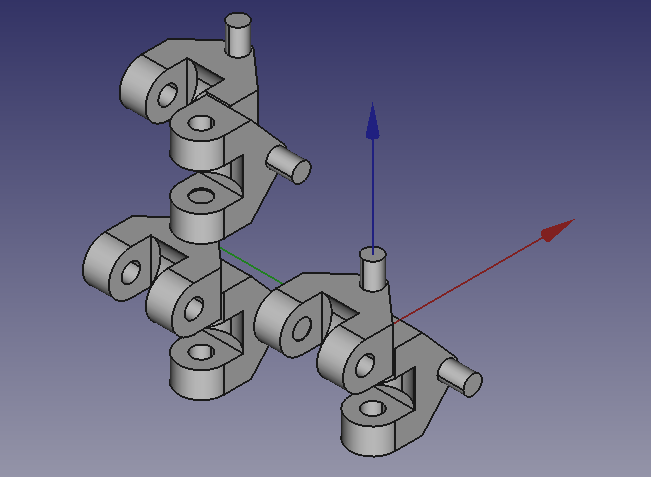
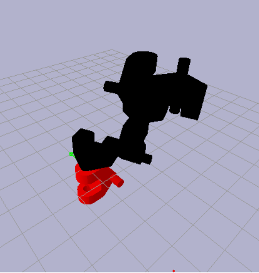

This example has 6 links but you could have many more theoretically! Download all of this and run the .py file and pybullet should move the links.
Note that right now if you make a freecad assembly using this workbench and you delete a constraint or mess up there might be an error so something to improve
in the future. The URDF file (basically a text file) is updated every time you add an axial constraint in FreeCAD but there is nothing that 
deletes it from the urdf yet.

