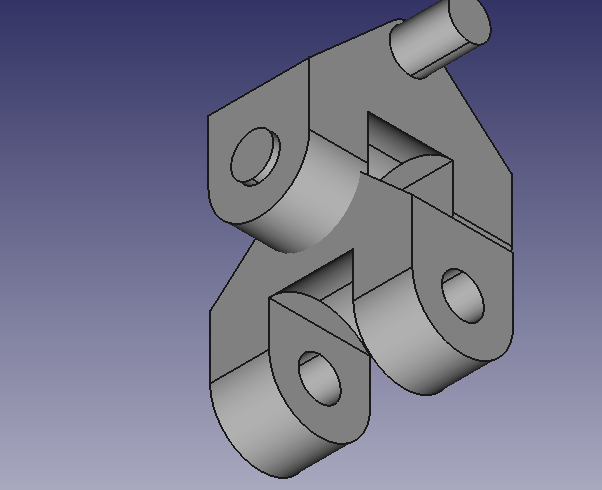
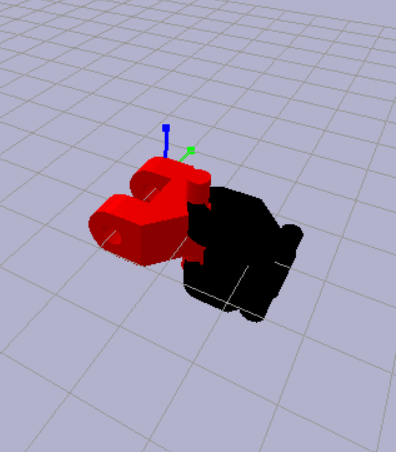
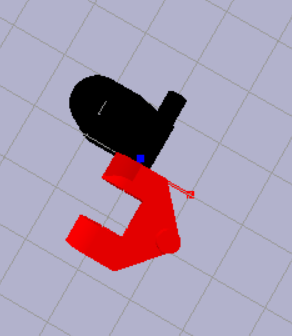

This is a simple demo to ensure accurate joint positioning/offsets/calibration useful for checking URDF creation. Currently focuses on revolute/axial rotational joints. A Universal Robot Definition File (URDF) is created when you click "Add Axis Coincident Constraint" in the A2plus menu. You can then run the python code included in this folder to import the URDF and run using PyBullet to see if the joints look the same as in FreeCAD. You can run the python file "pybulletURDFTest.py" to see if this works/lines up. Right now it lines up for some axes but not all for some reason? As stated earlier, PyBullet is designed for robotics and assemblies and kinematics so it is worth investigating using it to improve A2Plus' assembly simulation capabilities.

Also right now you need to select child and then parent when creating the constraints. If you do this backwards it will not load correctly in PyBullet (for now).

# FreeCAD Assembly (What it should look like)

# PyBullet Assembly (What it does look like, for this axis, Z I think. Lines up correctly when on the X axis)

# PyBullet Assembly X axis lined up correctly

