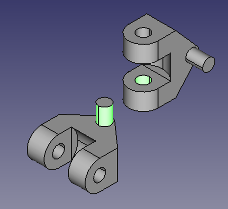

This is a simple demo to ensure accurate joint positioning/offsets/calibration useful for checking URDF creation. Currently focuses on revolute/axial rotational joints. A Universal Robot Definition File (URDF) is created when you click "Add Axis Coincident Constraint" in the A2plus menu. You can then run the python code included in this folder to import the URDF and run using PyBullet to see if the joints look the same as in FreeCAD. You can run the python file "pybulletURDFTest.py" to see if this works/lines up. 

In this workbench, after you have unzipped it to Mod and open the a2plustest2.fcstd document, you can move the objects using the 

button

You can click on the arrows to move linearly and click on the arc dot to rotate

A new URDF is created (or at least updated) every time you add an axial constraint with this workbench. This URDF can be used in pybullet.

To create an axial constraint for this demo, click on the two axial surfaces of each object that you want to constrain.

While these are still highlighted, click the axial constraint button
  in the workbench top menu bar and you will have your constraint and your new URDF file!

The more constraints you make, the more the URDF will be updated. There is no logic (yet) to check if the link already exists so if you have already created the 
urdf, delete a constraint and add another between the same two objects there will probably be an error.

The URDF should be at C:\Users\USER\a2plustest2   and you can specify this location in the pybulletURDFTest.py if you need to.

## PyBulletAssemblyDemo.FCMacro contained here is a macro that uses PyBullet to update the FreeCAD assembly visualization. 
The position and orientations need to be calibrated still but it is cool to look at and experiment with.
