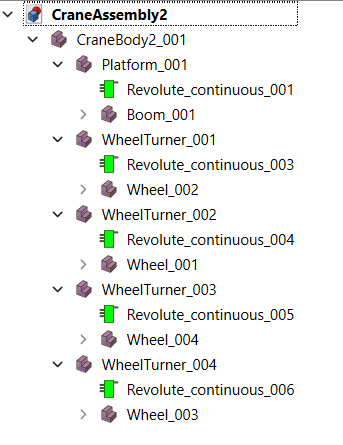

# FreeCAD-PyBullet Simulator

## Simulate Rigid Body Mechanics With Assemblies Directly in FreeCAD and Export to PyBullet Also
##### This project aims to improve FreeCAD's A2Plus assembly creation workbench by:

1. Writing new user-added joints to a Universal Robot Definition File (URDF) that can be used by PyBullet, a physics and robotics framework that may have better performance than the current A2Plus solver.
2. Updating the movement and simulation of component positions in FreeCAD using PyBullet, allowing for more complicated and smoother moving assemblies for larger numbers of components.
3. Adding additional assembly navigation and accesibility tools.

### For example, from this FreeCAD Assembly created using this repository

### we can simulate a (very) basic helicopter in PyBullet:
[
[

### Here is a FreeCAD A2Plus Assembly:

### Here is the Same Assembly Exported to PyBullet:

### Check  out [Arm Link Demo](https://github.com/VallesMarinerisExplorer/A2plus/tree/master/Example_Assemblies/ArmLinkDemo) to create URDFs with FreeCAD and [T Handle Demo](https://github.com/VallesMarinerisExplorer/A2plus/tree/master/FreeCAD_PyBullet_Integration_Demo) for a demo on simulating object dynamics in FreeCAD using PyBullet

### Hierarchy Support
This fork also supports the creation of assembly hierarchies in the tree structure for easier navigation. Child objects are automatically added beneath the parent object like this:

### Here is a link to Bullet/PyBullet for the physics simulation aspect:
https://github.com/bulletphysics/bullet3

### Here is some additional documentation on the existing A2plus Workbench that this project is based on:

# A2plus
[Documentation](https://wiki.freecadweb.org/A2plus_Workbench) • 
[Forum](https://forum.freecadweb.org/viewtopic.php?f=20&t=29207) •
[Git repository](https://github.com/kbwbe/A2plus)
